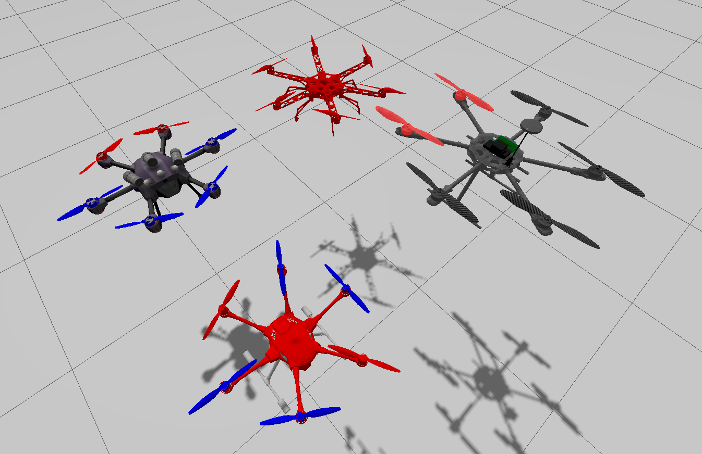
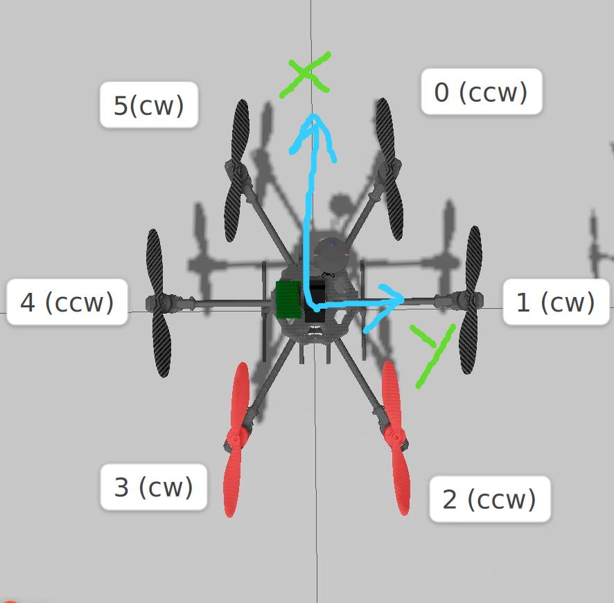

# hexacopter_models
A repo of various hexacopter models setup for simulation in ignition gazebo (not gazebo classic). Currently tested in citadel, may or may not be compatible with fortress or garden on account of the plugins.

## Available models with plugins
* f550 - no plugins 
* x4 - motors, imu
* tarot 680 - motors, imu
* typhoon h480 - motors, imu

## plugins usage
The drones have been set with plugins. 

### Motors 
Command: `ign topic -t /<namespace>/command/motor_speed -m ignition.msgs.Actuators -p 'velocity:[5,5,5,5,5,5]'`
 
shutdown: `ign topic -t /<namespace>/shutdown -m ignition.msgs.Int32_V -p 'data:[0,1,2]'`

(shutdown is used for setting a motor/motors to zero velocity, aka stopping the motor. Sending a shutdown message to the same motor ID again will re-enable it. while the motor is shutdown it will not respond to speed commands. After reenabling it will set to the last sent command message.)

### IMU
echo: `ign topic -e -t /<namespace>/imu`

### namespaces: 
`tarot`, `typhoon`, `X4`. Can be changed from sdf files if required.

## Conventions
The conventions shown below are the same for all models. Motors are numbered about +ve Z-axis of the body frame (it points downward).

## Running the simulation
* ensure that ignition gazebo is installed with `ign gazebo --version`. Additionally, try running `ign gazebo shapes.sdf`. 
* clone or download this repo.
* navigate to the root folder `hexacopter_models`.
* source the models and plugins used `source setup.bash`. 
* run `ign gazebo worlds/empty_world.sdf`